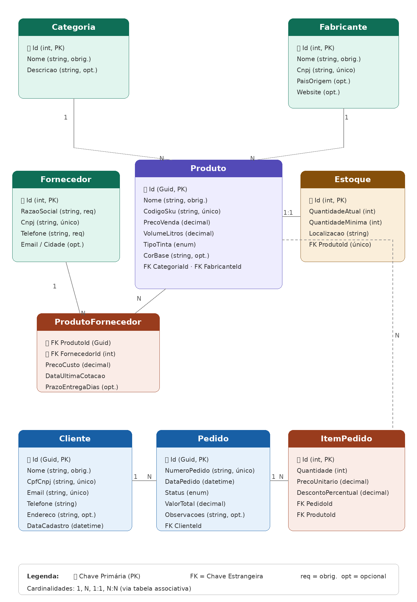

# LojaTintas — CP1 + CP2 + CP3 + CP4 + CP5

## Integrantes

| Nome | RM |
|------|-----|
| Andrei de Paiva Gibbini | 563061 |

---

## Domínio

Sistema de gerenciamento para uma loja de tintas: cadastro de produtos, controle de estoque, pedidos de venda e relacionamento com fornecedores e fabricantes.

## Entidades

| Entidade | PK |
|---|---|
| `Categoria` | `int Id` |
| `Fabricante` | `int Id` |
| `Produto` | `Guid Id` |
| `Estoque` | `int Id` |
| `Fornecedor` | `int Id` |
| `ProdutoFornecedor` | `(Guid ProdutoId, int FornecedorId)` |
| `Cliente` | `Guid Id` |
| `Pedido` | `Guid Id` |
| `ItemPedido` | `int Id` |

## Relacionamentos

| Relacionamento | Cardinalidade |
|---|---|
| Categoria → Produto | 1:N |
| Fabricante → Produto | 1:N |
| Produto → Estoque | 1:1 |
| Produto ↔ Fornecedor | N:N via `ProdutoFornecedor` |
| Cliente → Pedido | 1:N |
| Pedido → ItemPedido | 1:N |
| Produto → ItemPedido | 1:N |

## Arquitetura

Clean Architecture em 4 projetos:

- **Domain** — entidades e enums, sem dependências externas
- **Application** — interfaces dos repositórios
- **Infrastructure** — EF Core, DbContext, Fluent API, implementações
- **API** — entry point, DI, controllers REST, DTOs, Swagger (por versão), GlobalExceptionHandler, health checks, logs, versionamento e rate limit
- **Domain.Tests** / **Application.Tests** — testes xUnit (unidade de domínio e de aplicação)

## Banco de Dados

SQLite — arquivo `loja_tintas.db` criado automaticamente na raiz da API.

```json
{
  "ConnectionStrings": {
    "DefaultConnection": "Data Source=loja_tintas.db"
  }
}
```

## Como executar

```bash
dotnet restore

dotnet ef database update --project LojaTintas.Infrastructure --startup-project LojaTintas.API

dotnet run --project LojaTintas.API
```

## Endpoints

| Método | Rota | Descrição |
|--------|------|-----------|
| `GET` | `/health` | Health check (self + banco + dependência externa), JSON detalhado |
| `GET` | `/api/categorias` | Lista categorias |
| `GET` | `/api/categorias/{id}` | Busca categoria por id |
| `POST` | `/api/categorias` | Cria categoria |
| `PUT` | `/api/categorias/{id}` | Atualiza categoria |
| `DELETE` | `/api/categorias/{id}` | Remove categoria |
| `GET` | `/api/produtos` | Lista produtos |
| `GET` | `/api/produtos/{id}` | Busca produto por id |
| `GET` | `/api/produtos/por-categoria/{categoriaId}` | Lista produtos de uma categoria |
| `POST` | `/api/produtos` | Cadastra produto |
| `GET` | `/api/clientes` | Lista clientes |
| `GET` | `/api/clientes/{id}` | Busca cliente por id |
| `POST` | `/api/clientes` | Cadastra cliente |
| `GET` | `/api/pedidos` | Lista pedidos — **v2** (padrão): paginada; **v1** (deprecada): array completo. Ver [Versionamento](#versionamento-de-api-cp5) |
| `GET` | `/api/pedidos/{id}` | Busca pedido com itens |
| `POST` | `/api/pedidos` | Cria pedido (**rate limit**: 10 req/min por IP) |

## Swagger

Com a API em execução (ambiente Development), a documentação interativa fica em:

```
http://localhost:5169/swagger
```

Exemplos de chamada prontos em `LojaTintas.API/LojaTintas.API.http`.

## Repositório genérico

`IRepository<T>` (Application) + `Repository<T>` (Infrastructure, EF Core) — registrado na DI como serviço aberto:

```csharp
builder.Services.AddScoped(typeof(IRepository<>), typeof(Repository<>));
```

Usado diretamente pelo `CategoriasController` (CRUD completo). Convive com os repositórios específicos por agregado do CP2 (`IProdutoRepository`, `IClienteRepository`, `IPedidoRepository`, `IEstoqueRepository`), que seguem sendo usados onde há consultas além do CRUD mínimo (ex.: busca por SKU, por CPF/CNPJ, por status).

## Tratamento global de erros

`GlobalExceptionHandler` (API), implementando `IExceptionHandler`, converte exceções em `ProblemDetails` (`application/problem+json`):

| Exceção | Status HTTP |
|---|---|
| `ResourceNotFoundException` | 404 |
| `ConflictException` | 409 |
| `ArgumentException` | 400 |
| `DomainException` (demais) | 400 |
| Payload inválido (validação do `[ApiController]`) | 400 |
| Qualquer outra exceção | 500 (mensagem genérica fora de Development) |

## Health checks

`GET /health` é o único endpoint de health check, com relatório completo em JSON (status geral, duração total, `traceId` e a lista de checks nomeados). Status HTTP alinhado ao runtime: **Healthy/Degraded → 200**, **Unhealthy → 503**.

Checks registrados (`AddLojaTintasHealthChecks`, em `LojaTintas.API/Extensions/HealthCheckServiceExtensions.cs`):

| Check | O que verifica | Abordagem |
|---|---|---|
| `self` | Processo está no ar | `HealthCheckResult.Healthy` direto |
| `database` | Conexão com o SQLite via `LojaTintasDbContext` | `AddDbContextCheck<TContext>` (opção A do enunciado) |
| `fiap-website` | Dependência externa de exemplo (item recomendado) | `IHealthCheck` customizado (`FiapWebsiteHealthCheck`), faz um `GET` em `https://www.fiap.com.br` |

Exemplo de resposta **Healthy**:

```json
{
  "status": "Healthy",
  "totalDurationMs": 42.1,
  "traceId": "0HN...",
  "checks": [
    { "name": "self", "status": "Healthy", "durationMs": 0.01, "description": "API em execução." },
    { "name": "database", "status": "Healthy", "durationMs": 12.3, "description": null },
    { "name": "fiap-website", "status": "Healthy", "durationMs": 29.7, "description": "FIAP respondeu 200." }
  ]
}
```

**Para simular falha do banco (→ 503):** com a API rodando, pare-a, adicione um bloco `ConnectionStrings` com caminho inválido em `LojaTintas.API/appsettings.Development.json` (esse arquivo não tem `ConnectionStrings` hoje — a connection string vem do `appsettings.json`; adicionando aqui ela sobrepõe só em Development):

```json
{
  "ConnectionStrings": {
    "DefaultConnection": "Data Source=/caminho/que/nao/existe/x.db"
  }
}
```

Suba a API de novo (`dotnet run`) — o check `database` vira `Unhealthy` e o `/health` responde **503**. Reverta o arquivo depois do teste (não commitar).

*Observação:* o check `fiap-website` depende de acesso real à internet da máquina onde a API roda. Se essa URL não responder, o `/health` inteiro fica `Unhealthy` (503) mesmo com banco e processo OK — comportamento esperado, um check `Unhealthy` derruba o status agregado.

## Observabilidade (logs)

- `GlobalExceptionHandler` loga toda exceção não tratada em nível **Error**, com `traceId` (`HttpContext.TraceIdentifier`) e o path/método da requisição. Em Development, o mesmo `traceId` também vai na resposta (`ProblemDetails.Extensions["traceId"]`) para facilitar correlacionar log ↔ resposta; em Production a resposta não expõe detalhe interno, só o log.
- `PedidosController.Criar` (fluxo de escrita) loga **início** (`ClienteId`, quantidade de itens, `traceId`) e **sucesso** (`PedidoId`, `NumeroPedido`, `ValorTotal`, `traceId`) com propriedades nomeadas (`ILogger` estruturado, sem concatenar string).

## Testes (xUnit)

```bash
dotnet test
```

Dois projetos de teste, na mesma solution:

- **`LojaTintas.Domain.Tests`** — referencia só o `Domain` (sem Infrastructure/API). Testa `Pedido.AdicionarItem`, uma regra de negócio real (invariantes de quantidade > 0 e desconto entre 0–100%, cálculo do valor total): `[Fact]` no caminho feliz + `[Theory]`/`[InlineData]` nos caminhos de erro.
- **`LojaTintas.Application.Tests`** — referencia o `Application`, mocka `IPedidoRepository`/`IClienteRepository`/`IProdutoRepository` com **Moq**. Testa `PedidoService.CriarPedidoAsync`: cliente ou produto inexistente → lança `ResourceNotFoundException` e **não** chama `AdicionarAsync` (`Times.Never`); caminho feliz → persiste uma vez (`Times.Once`). **CP5:** `PaginationParamsTests` (`[Theory]` + `[InlineData]` para `page`/`pageSize` inválidos, `[Fact]`/`[Theory]` para o intervalo válido) e `PedidoServicePaginacaoTests` (valores inválidos não chegam ao repositório; envelope com `totalPages` coerente; página além do total → `items` vazio).

## Versionamento de API (CP5)

Recurso escolhido: **Pedidos** (o que mais cresce no domínio). `CategoriasController`, `ClientesController` e `ProdutosController` seguem no ar sem mudança, marcados com `[ApiVersionNeutral]` — respondem com ou sem versão e aparecem nos dois grupos do Swagger (sem isso, `?api-version=1.0` neles daria 400).

| Versão | Status | `GET /api/pedidos` devolve |
|---|---|---|
| **1.0** | **Deprecada** (`[ApiVersion("1.0", Deprecated = true)]`) | O contrato antigo do CP3: **array** com todos os pedidos, sem paginação |
| **2.0** | Atual e **padrão** (`DefaultApiVersion = 2.0`) | **Envelope paginado** (ver abaixo) |

Os dois contratos chamam o **mesmo** `IPedidoService` (`ObterTodosAsync` para a v1, `ObterPaginadoAsync` para a v2) — não existe service duplicado por versão. `GET /api/pedidos/{id}` e `POST /api/pedidos` valem para as duas versões; portanto o fluxo de escrita do CP3 continua funcionando **sem informar versão**, com `api-version=1.0` ou com `api-version=2.0`.

### Como o cliente escolhe a versão

| Como | Requisição | Resultado |
|---|---|---|
| Query string | `GET /api/pedidos?api-version=1.0` | 200 + **array** (v1) |
| Header | `GET /api/pedidos` com `X-Api-Version: 1.0` | 200 + **array** (v1) |
| Omitida | `GET /api/pedidos` | 200 + **envelope** (cai na 2.0) |
| Explícita 2.0 | `GET /api/pedidos?api-version=2.0` | 200 + envelope |

Toda resposta de um endpoint versionado traz `api-supported-versions: 2.0` e `api-deprecated-versions: 1.0` (`ReportApiVersions = true`).

### URLs (API em `http://localhost:5169`)

| O quê | URL |
|---|---|
| Swagger UI (Development; seletor com os dois grupos) | `http://localhost:5169/swagger` |
| Swagger JSON v1.0 (deprecada) | `http://localhost:5169/swagger/v1.0/swagger.json` |
| Swagger JSON v2.0 | `http://localhost:5169/swagger/v2.0/swagger.json` |
| Health check | `http://localhost:5169/health` |
| **Listagem v1** (array) | `http://localhost:5169/api/pedidos?api-version=1.0` |
| **Listagem v2** (envelope, 1ª página) | `http://localhost:5169/api/pedidos` ou `...?api-version=2.0&page=1&pageSize=20` |

No Swagger, o documento da **v1.0** traz na descrição o aviso de versão **deprecada** e suas operações aparecem marcadas como `deprecated`. A v1 e a v2 usam leitores por **query** (`api-version`) e por **header** (`X-Api-Version`).

## Paginação (CP5 — só na listagem v2)

A v1 **não** pagina: paginar o array dela seria breaking change silencioso.

| Parâmetro | Padrão | Regra |
|---|---|---|
| `page` | `1` | inteiro ≥ 1 |
| `pageSize` | `20` | inteiro de **1 a 100** (teto = 100) |

- `page < 1` ou `pageSize` fora de 1–100 → **400** (`application/problem+json`) com mensagem dizendo qual regra falhou.
- Página além do total → **200** com `items: []` (não é erro, não é 404).
- Os itens vêm ordenados por `DataPedido` decrescente, com `Id` como desempate (ordem estável: página 1 e 2 não se sobrepõem).

Exemplo — `GET /api/pedidos?page=2&pageSize=2`:

```json
{
  "page": 2,
  "pageSize": 2,
  "totalItems": 5,
  "totalPages": 3,
  "hasPrevious": true,
  "hasNext": true,
  "items": [ { "id": "...", "numeroPedido": "PED-..." }, { "id": "...", "numeroPedido": "PED-..." } ]
}
```

`totalPages` = teto de `totalItems / pageSize`.

**Onde cada camada entra**

| Camada | O que faz |
|---|---|
| API (`PedidosController`) | Lê `page` e `pageSize` da query (padrões 1 e 20) e repassa ao serviço |
| Application | `PaginationParams.Create` valida o intervalo (lança `ArgumentException` → o `GlobalExceptionHandler` responde 400); `PedidoService.ObterPaginadoAsync` monta o envelope `PagedResult<PedidoResponseDto>` (DTO fica em Application, não na entidade) |
| Infrastructure | `PedidoRepository.GetPagedAsync`: `Count` + `OrderByDescending(DataPedido).ThenBy(Id)` + `Skip` + `Take` sobre o `IQueryable`, e só então `ToListAsync` — a página é cortada **no SQL**, nada de `GetAll()` + `Skip` em memória |

## Rate limit (CP5)

Middleware nativo `Microsoft.AspNetCore.RateLimiting` (sem pacote de terceiros), política **fixed window** particionada por **IP**.

| Política | Onde | Limite | Janela |
|---|---|---|---|
| `escrita` | `POST /api/pedidos` | **10 requisições** | **1 minuto** por IP |
| `leitura` | `GET /api/pedidos` (v2) | 100 requisições | 1 minuto por IP |

Ao estourar a `escrita`: **429** com header `Retry-After` (segundos até a janela reabrir) e corpo `application/problem+json` (`status: 429`, `title: "Muitas requisições"`, `detail` com o tempo de espera).

- Não há limitador global: só endpoints com `[EnableRateLimiting]` entram no teto. `GET /health` ainda recebe `.DisableRateLimiting()` explícito — depois de estourar o `POST`, `/health` continua **200**.
- Ordem no pipeline: `UseExceptionHandler()` → … → `UseRateLimiter()` → `MapControllers()`.
- O limiter conta toda requisição que chega ao endpoint, mesmo com payload inválido (400) — dá para estourar o teto sem montar um pedido válido.

**Como ver o 429** (11 requisições em sequência; a 11ª deve voltar 429):

```bash
for i in $(seq 1 12); do
  curl -s -o /dev/null -w "%{http_code}\n" -X POST http://localhost:5169/api/pedidos \
    -H "Content-Type: application/json" \
    -d '{"clienteId":"00000000-0000-0000-0000-000000000000","itens":[]}'
done
# detalhe da resposta 429 (headers + corpo):
curl -i -X POST http://localhost:5169/api/pedidos -H "Content-Type: application/json" -d '{}'
# o health segue de fora do teto:
curl -i http://localhost:5169/health
```

No PowerShell use `curl.exe` (e não o alias `curl`). Chamadas prontas também em `LojaTintas.API/LojaTintas.API.http`.

## Diagrama MER


